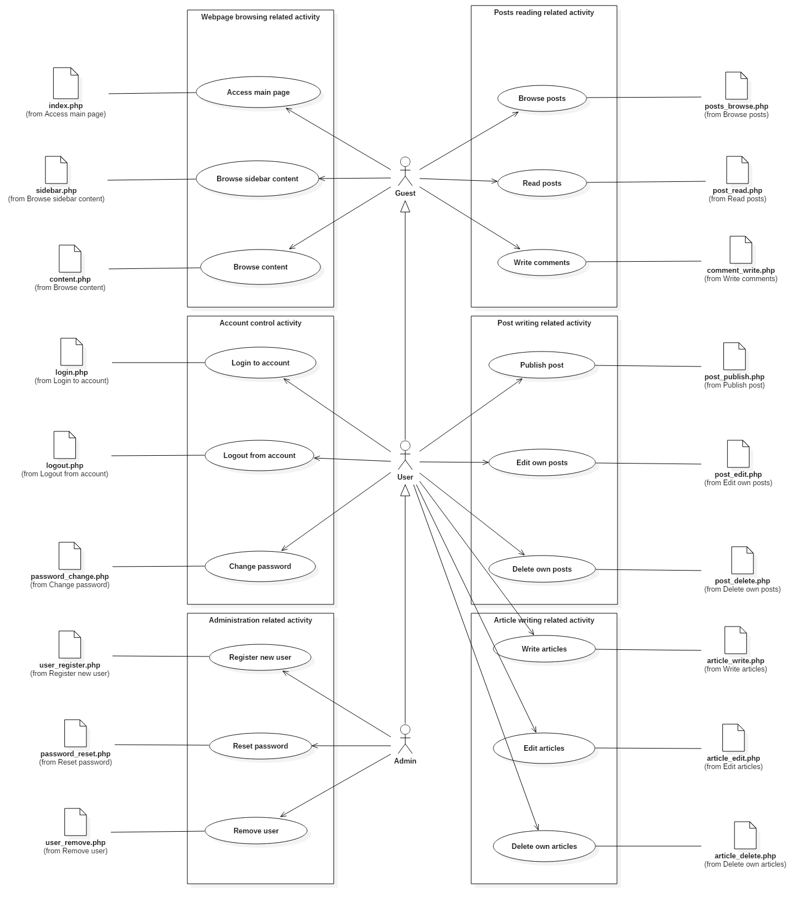
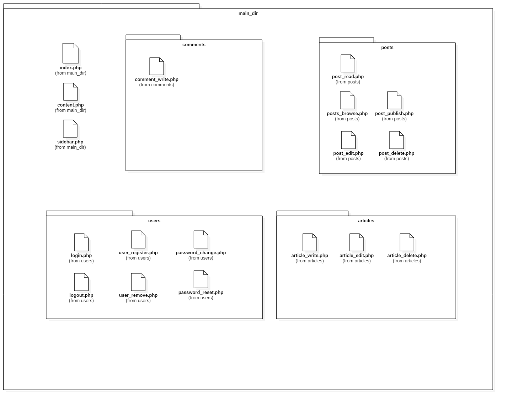

# Kitten Pages

A simple PHP system for information page.

- Added simple registration/login system.
- Added posting system.
- Added showing content system.
- Improved CSS and post design.

#### Activities model

#### Files arrangment

#### TODOs

- [ ] Add Delete/Edit system.
- [x] Fix post display.
- [ ] Add Markdown/MathJax parser.
- [ ] Add AJAX/jQuery system.
- [ ] Add Bootstrap.

#### Includes
- [HTML Generator](https://github.com/Ch3shireDev/html-generator)
- [Parsedown](http://parsedown.org/)
- [Parsedown extra](https://github.com/erusev/parsedown-extra)
- [MathJax](https://www.mathjax.org/)

