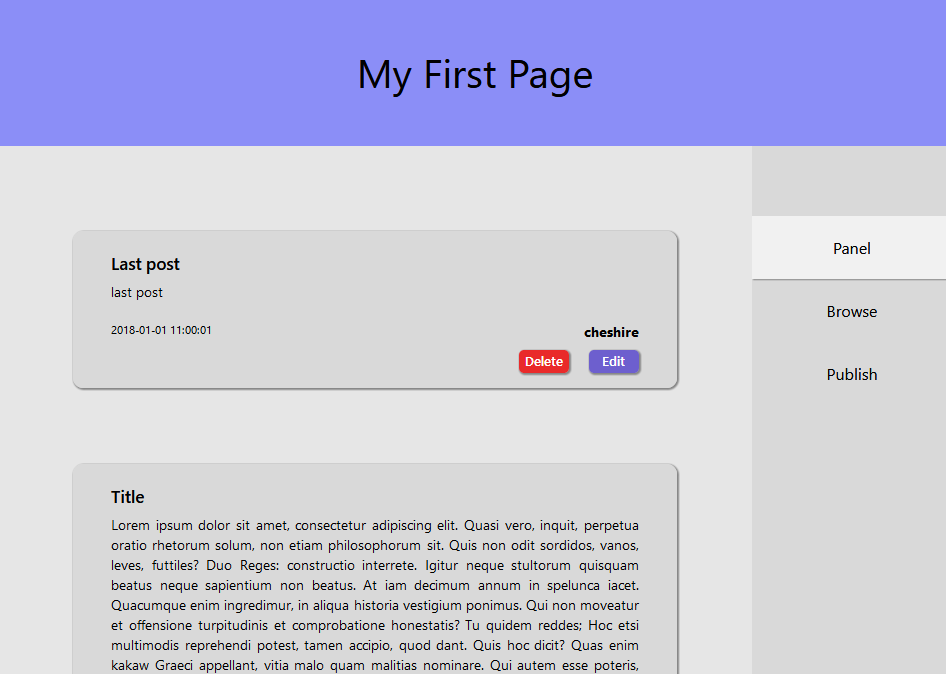
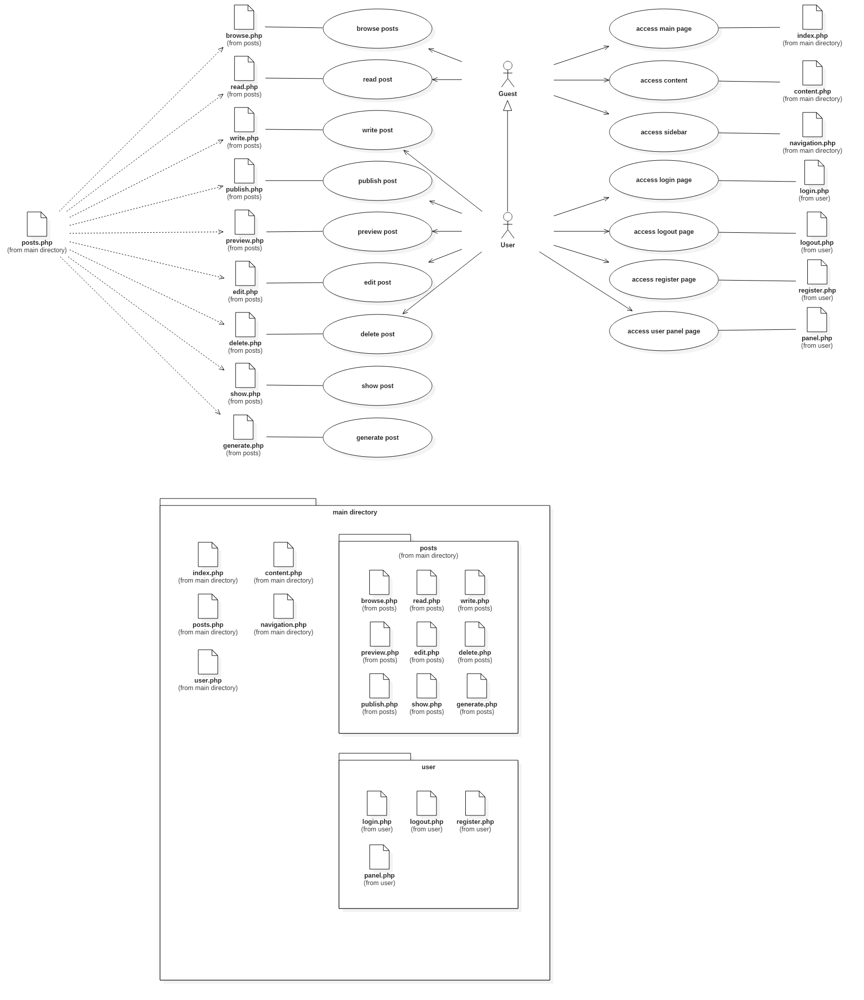

# Kitten Pages

A simple PHP system for information page.

- Reset of all structure (old files in `./old`).

#### Activities model and file arrangement

#### TODOs

- [x] Fixed post display.
- [x] Added AJAX/jQuery system.
- [x] Added Browse Posts system.
- [x] Added Delete Post system.
- [x] Added Write Post system.
- [x] Added Preview Post system.
- [ ] Added Publish Post system.
- [ ] Added Edit Post system.
- [ ] Added Markdown/MathJax parser.
- [ ] Added Bootstrap.

#### Includes
- [HTML Generator](https://github.com/Ch3shireDev/html-generator)
- [Parsedown](http://parsedown.org/)
- [Parsedown extra](https://github.com/erusev/parsedown-extra)
- [MathJax](https://www.mathjax.org/)

